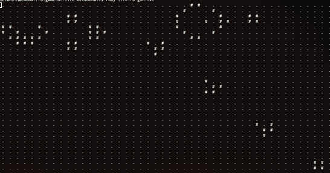

# game-of-life
Implementation of the [Game of Life Project](https://robertheaton.com/2018/07/20/project-2-game-of-life/) in [Robert Heaton's](https://twitter.com/robjheaton) "Programming Projects for Advanced Beginners" series.

I am trying to learn Ruby and have fun on the way by following these projects. So, don't learn anything from my code. If you find something good, please know that it was unintentional 😁

## 🌟life 🌟
```
ruby life.rb gun.txt
```

